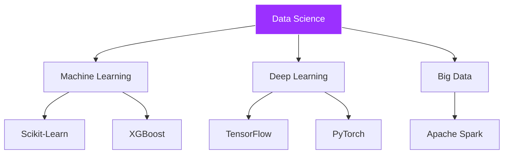
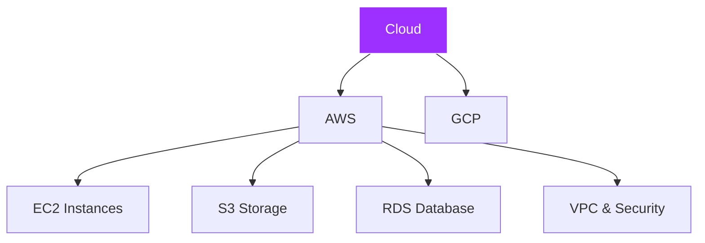

About me / Acerca de mi 👩‍💻


# 👩‍💻 Hi, I'm Patricia García

I'm a Petroleum Engineer with experience in the energy sector, currently transitioning into the world of Data.  
I specialize in **Data Science**, **Machine Learning**, and **Cloud Computing (AWS/GCP)**.  
Currently, I'm working on projects using Python, SQL, Power BI, and AI tools.

## 🧠 Technologies I work with

**Languages and Libraries:**  
Python · SQL · Pandas · NumPy · Scikit-learn · TensorFlow · PyTorch · Matplotlib · Seaborn

**Data Visualization Tools:**  
Power BI · Tableau

**Cloud & Big Data:**  
AWS (EC2, S3, IAM, RDS, VPC) · GCP · Apache Spark


<!-------------------------------------------------------------------------------------------------------------------------------------------------------------->
# 📈 Statistics 
  
<h1 align="center">Github Metrics </h1>
<p align="center">
  
</p>


<!--Skill And More Information--> 

# 📊 Stats

<div align="center">  
   
  
  
</div>


Contributions
   
<p align="center">
  
  
  
</p>

<!-------------------------------------------------------------------------------------------------------------------------------------------------------------->

# 🌐 Social Media

[](https://www.linkedin.com/in/patri-data-engineering/)
[](lpgguzman.coders23@gmail.com)
[](https://www.kaggle.com/patriciagarciaguzmn)
</div>

<!-------------------------------------------------------------------------------------------------------------------------------------------------------------->

# 👩‍💻Skills

1. Data Analyst
    
```mermaid
graph TD;
    Data-Analyst-->SQL;
    Data-Analyst-->Python;
    Data-Analyst-->PowerBi;
    Data-Analyst-->Tableu;
    Data-Analyst-->Excel;
    Data-Analyst-->Knime;
   ```
2. Data Science

```mermaid
graph TD;
    Data-Science-->Python;
    Data-Science-->Linux;
    Data-Science-->Git;
    Data-Science-->GitHub;
    Data-Science-->Machine-Learning;
    Machine-Learning -->Scikit-Learn;
    Machine-Learning -->PyTorch;
    Machine-Learning -->TensorFlow;
    Machine-Learning -->Keras;
    Machine-Learning -->XGBoost;
    Machine-Learning -->Statsmodels;
    Data-Science-->Deep-Learning;
    Deep-Learning -->TensorFlow;
    Deep-Learning -->Keras;
    Deep-Learning -->PyTorch;
    Data-Science-->Big-Data;
    Big-Data -->Apache-Spark;
    Big-Data -->Scala;
   ```
3. Cloud

```mermaid
graph TD;
    Cloud-->AWS;
    AWS-->Instances-EC2;
    AWS-->Storage-S3;
    AWS-->Virtual-Private-Cloud-VPC;
    Virtual-Private-Cloud-VPC-->Security-Groups;
    Virtual-Private-Cloud-VPC-->Subnets;
    AWS--> Database;
    Database --> RDS;
    Database --> Dynamo;
    AWS--> IAM;
    Cloud-->GCP;
    GCP-->DEVOP`s;
   ```    

<p align="center">  
    
      
     
     
  
    
  
  
    
   
  
  
  
  
  
</p>


<!-------------------------------------------------------------------------------------------------------------------------------------------------------------->
# 🗺️ Map 

📍 Coding from Madrid, Spain


<!-------------------------------------------------------------------------------------------------------------------------------------------------------------->
# 👁 Views 


Countries

[Click Here](https://s01.flagcounter.com/more/X70) 👈 ``0D1117``

<!--- Country ---> 

<a href="https://info.flagcounter.com/Wdl7"></a>


<!-------------------------------------------------------------------------------------------------------------------------------------------------------------->
# 🐛 Snyken 

1. My snake path
   


<!-------------------------------------------------------------------------------------------------------------------------------------------------------------->
# ➕ Plus

<p align="center">
  
</p>

<h3 align="left">Knowledge</h3>
<table width="100%">
    <tbody>
        <tr valign="top">
            <td width="16.6%" align="center">
            <span><strong>Python</strong></span><br>
            
            </td>
            <td width="16.6%" align="center">
            <span><strong>Amazon Web Services (AWS)</strong></span><br>
            
            </td>
            <td width="16.6%" align="center">
            <span><strong>Google Cloud Platform (GCP)</strong></span><br>
            
            </td>
            <td width="16.6%" align="center">
            <span><strong>Apache Spark</strong></span><br>
            
            </td>
            <td width="16.6%" align="center">
            <span><strong>Linux</strong></span><br>
            
            </td>
        </tr>
        <tr valign="top">
            <td width="16.6%" align="center">
            <span><strong>Git</strong></span><br>
            
            </td>
            <td width="16.6%" align="center">
            <span><strong>Pandas</strong></span><br>
            
            </td>
            <td width="16.6%" align="center">
            <span><strong>NumPy</strong></span><br>
            
            </td>
            <td width="16.6%" align="center">
            <span><strong>Matplotlib</strong></span><br>
            
            </td>
            <td width="16.6%" align="center">
            <span><strong>Seaborn</strong></span><br>
            
            </td>
        </tr>
    </tbody>
</table>

<p align="center">

</p>


  <!-------------------------------------------------------------------------------------------------------------------------------------------------------------->
  
      
    <!-------------------------------------------------------------------------------------------------------------------------------------------------------------->

</div>
 <!--Final Conhecimento das Tecnologias - End Knowledge of Technologies--> 
 
<!-------------------------------------------------------------------------------------------------------------------------------------------------------------->
 
 <!--Início da tabela e espessura da borda-->
 <!--Inicial table and width border-->
 <table border = "15">
  <td align="center">Python</td>
                          
  </table>   
 <!--Final da Tabela - End table-->
</div>

<!--Final Projetos de Estudos Futuros - End Future Studies Projects-->  
<!-------------------------------------------------------------------------------------------------------------------------------------------------------------->

<a href="https://github.com/antonkomarev/github-profile-views-counter">
    
</a>

<!-------------------------------------------------------------------------------------------------------------------------------------------------------------->

## 🏙️ Desde Berlín, con código 📌

Gracias por visitar mi perfil 💜 ¡Estoy abierta a colaborar en proyectos de datos, energía y tecnología!

-------------------------------


# 👋 Hi, I'm Patricia García


## 🚀 About Me

I'm a **Petroleum Engineer** transitioning into the world of **Data Science & Analytics**. Currently focused on building scalable data solutions using cloud technologies and machine learning.

- 🔭 Working with: Python, SQL, AWS, Machine Learning & Data Visualization
- 🌱 Learning: Deep Learning, Big Data with Apache Spark
- 📍 Location: Madrid, Spain
- 💼 Open to collaborate on: Data Science, Energy Tech & Cloud projects

---

## 🛠️ Tech Stack

### Programming & Data Analysis


### Machine Learning & Deep Learning


### Data Visualization


### Cloud & DevOps


---

## 📊 GitHub Stats

<div align="center">
  
  
</div>

<div align="center">
  
</div>

---

## 🎯 Skills Overview

### Data Analyst
```mermaid
graph LR;
    A[Data Analyst] --> B[SQL];
    A --> C[Python];
    A --> D[Power BI];
    A --> E[Tableau];
    A --> F[Excel];
    style A fill:#9b30ff,stroke:#fff,color:#fff
```

### Data Science & ML


### Cloud Architecture


---

## 🌐 Connect With Me

<div align="center">

[](https://www.linkedin.com/in/patri-data-engineering/)
[](mailto:lpgguzman.coders23@gmail.com)
[](https://www.kaggle.com/patriciagarciaguzmn)

</div>

---

## 🏆 GitHub Trophies

<div align="center">
  
</div>

---

## 📈 Contribution Graph

<div align="center">
  
</div>

---

## 💜 Thanks for Visiting!

<div align="center">
  


**Open to collaborate on Data Science, Energy & Tech projects** 🚀

</div>


